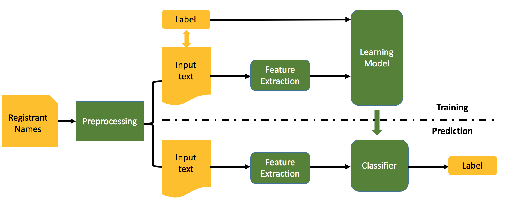
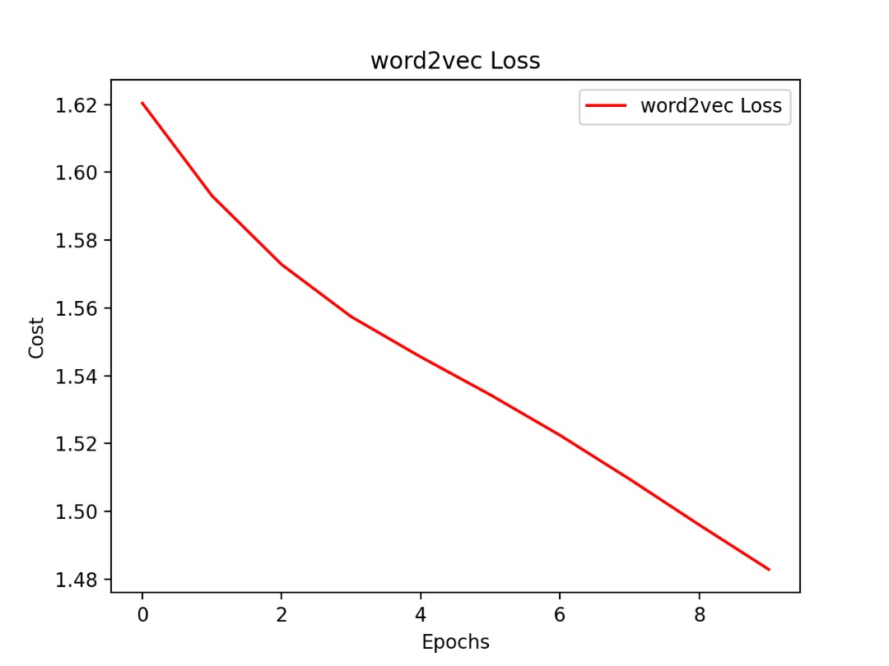
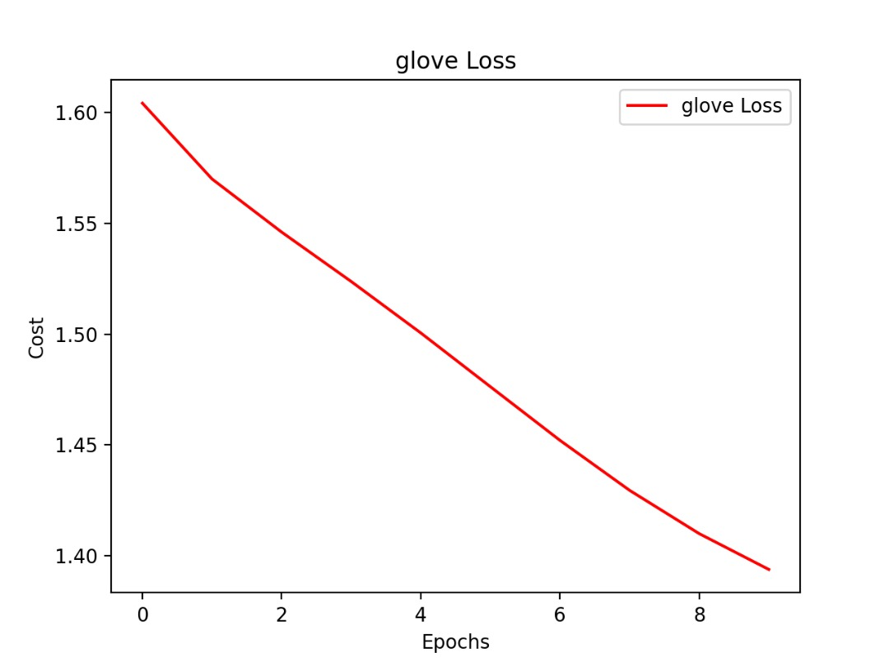
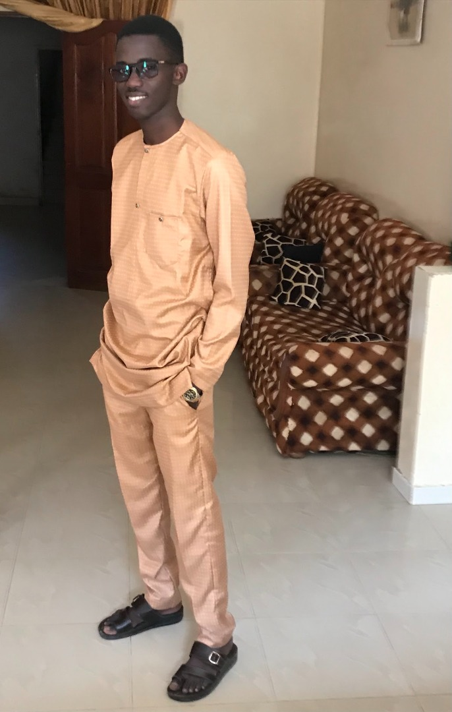
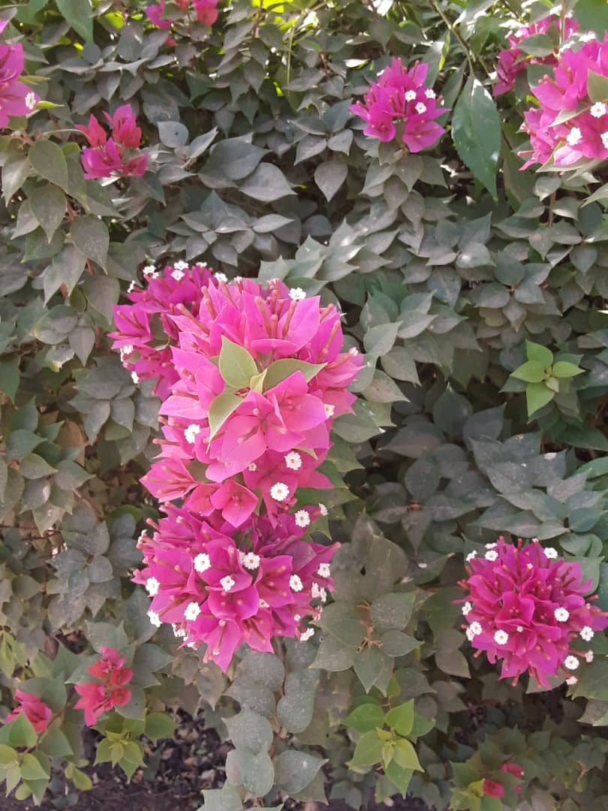

## Problem understanding: Text Classification Using Fully-connected (FC) Neural Network (NN).
In this project we use NN, namely FC NNs, for the task of text classification. </br>

<!-- 
 -->

 
<!-- <br> -->
Refer to this [link](https://www.kaggle.com/datasets/prakharrathi25/google-play-store-reviews) to get the data.

# Run the project #
In this project, we have two steps: training and predicting. In the predict step, you can write any sentence for the model from your laptop and predict the class of review the sentence belongs to. Let's show you how to run the project.

If you do not have venv package, please refer to this [link](https://linuxize.com/post/how-to-create-python-virtual-environments-on-ubuntu-18-04/)
</br>

## Create virtual environment ##

```
$ python3 -m venv ENV_NAME
```
## Activate your environment ##

```
$ source ENV_NAME/bin/activate
```

## Requirement installations ##
To run this, make sure to install all the requirements by:

```
$ pip install -r requirements.txt 
```
# Training the model #

```
$ python3 main.py -w word_representation -n num_epochs -max 
$ python3 main.py -w word_representation -n num_epochs -sml set_max_length
```
## Example of running models ##

```
$ python3 main.py -w word2vec -n 100 -max
```

```
$ python3 main.py -w glove -sml 20
```

# Results Presentation

``` Word2Vec Loss```  </br>
 

``` GloVe Loss```  </br>
 

# Make prediction #

```
$python3 predict.py -w word_reprentation -s sentence
```

``` Example: Result```  </br>

{sentence: "Thank you for your nice presentation" 'predicted class': '4'}
---
___

---
___


# Related Projects #

* <a href= 'https://www.kaggle.com/code/preatcher/spam-classification-lstm-word2vec-98/notebook'> spam classification lstm, word2vec 98% </a>


# Contributors #
<div style="display:flex;align-items:center">

<div style="display:flex;align-items:center">
    <div>
        <h5> <a href='..'> Ababacar Dioubhane</a> </h5> 
<div>
    <h5> <a href='.'> Stephen Kiilu </a> </h5> 
    
<div>
    <h5> <a href='.'> Mouhamadou Mansour Sow</a> </h5> 
    
</div>
 <h5> <a href='.'> Ademola Abiodun Saheed</a> </h5> 
    
</div>
